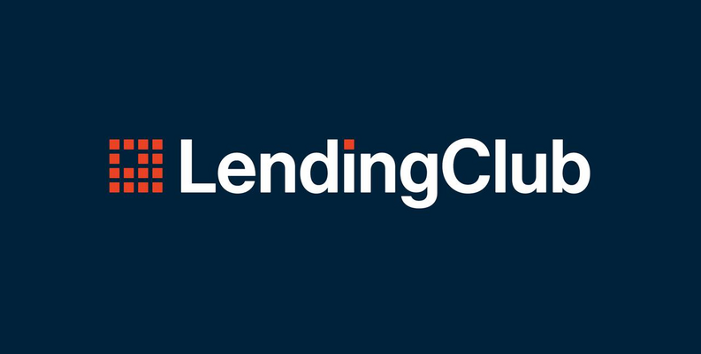
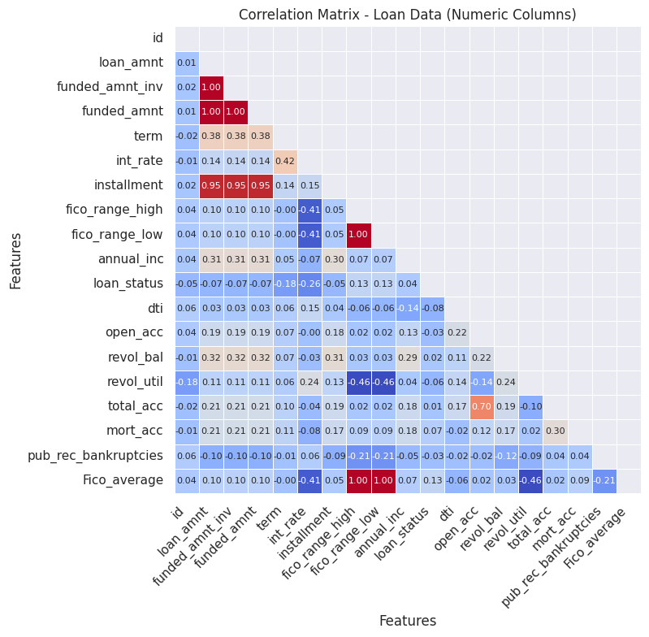
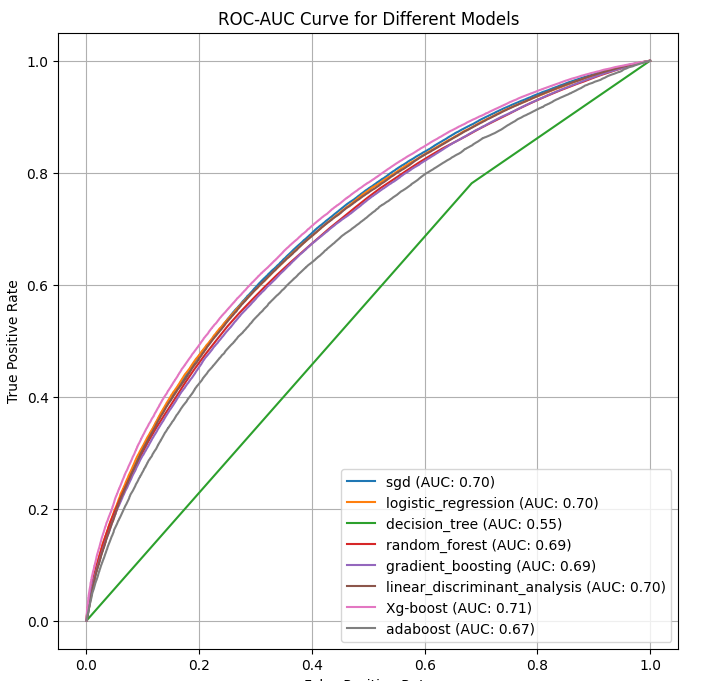

[](https://github.com/ellerbrock/open-source-badges/)
<!-- Update the URLs below with your Streamlit app link and Colab link if available -->
[](https://share.streamlit.io/aka5hbg/lending-club/main/app.py)
<!-- [](Your_Colab_Link_Here) -->

---

# Table of Contents

- [💼🔮 Lending Club Loan Default Prediction](#%F0%9F%92%BC%F0%9F%94%AE-lending-club-loan-default-prediction)
  - [Authors](#authors)
- [🎪 Introduction](#%F0%9F%8E%AA-introduction)
- [🌐 Understanding of Business](#%F0%9F%8C%90-understanding-of-business)
- [⚙️ Business Objectives](#%E2%9A%99%EF%B8%8F-business-objectives)
- [Data source](#data-source)
- [Implemented Techniques](#implemented-techniques)
- [Tech Stack](#tech-stack)
- [Results](#results)
- [Limitations and Potential Improvements](#limitations-and-potential-improvements)
- [Deployed on Microsoft Azure](#deployed-on-microsoft-azure)
- [Run Locally](#run-locally)
- [License](#license)


# 💼🔮 Lending Club Loan Default Prediction


## Authors

- [@aka5hbg](https://www.github.com/aka5hbg)

---

## 🎪 Introduction
In the transformative epoch of the **digital revolution**, **fintech startups** like **Lending Club** are pioneering a democratization of credit access. Being an online peer-to-peer lending platform, Lending Club is the linchpin connecting borrowers, often sidelined by traditional banking systems, with investors exploring diverse investment landscapes. However, every frontier has its challenges - here, it's loan defaults. This project is oriented towards the creation of a **predictive model**...

---

## 🌐 Understanding of Business
From the vantage point of an economist, Lending Club's model stands as an innovative panacea for credit market anomalies, often overshadowing traditional banks and financial institutions. Lending Club harnesses a multitude of data points - personal facets, credit history, loan purpose, and beyond - to accurately gauge the **creditworthiness** of loan applicants, an essential aspect in the mitigation of loan default risks.

---

## ⚙️ Business Objectives
This project sets its sights on enhancing Lending Club's risk assessment efficiency and fortifying the overall resilience of the peer-to-peer lending sector. The precise objectives are:

1. 🎛️ Devise a robust machine learning model to predict the likelihood of loan default.
2. 🎯 Pinpoint the key factors precipitating loan defaults.
3. 💡 Impart actionable insights to fine-tune Lending Club's risk assessment process.
4. 📈 Ultimately, trim down the number of loan defaults, bolster investor confidence, and boost the platform's profitability.

By realizing these objectives, we can aid Lending Club in fostering a balanced financial ecosystem where credit access is broadened, risks are adeptly managed, and profitability is ensured. This aligns with the overarching economic goal of financial inclusivity and stability in the lending arena.

---

## Data source

- [All Lending Club loan data](https://www.kaggle.com/datasets/wordsforthewise/lending-club)

---

## Implemented Techniques

- Exploratory Data Analysis (EDA)
- Bivariate Analysis
- Risk Analysis
- Machine Learning Modeling
- Data Visualization
- Feature Selection
- Model Evaluation
- Streamlit Application Development

---

## Tech Stack

#### Python:
- Jupyter Notebook
- Pandas
- Numpy
- Matplotlib
- Seaborn
- Scikit-Learn
- Imbalanced-Learn
- XGBoost
- Streamlit

#### App container
- Docker

#### Code Editor:
- VS Code

---


## Here is a quick overview of the key results

- Correlation between the features:
  


- ROC curve of all the classifier:
  

- Top 3 models with default parameters:

|    | Classifier    | Data   |   Accuracy |   Precision |   Recall |   F1-score |   ROC AUC |   Brier_score |
|---:|:--------------|:-------|-----------:|------------:|---------:|-----------:|----------:|--------------:|
|  0 | Xg-boost      | Test   |   0.80349  |    0.813589 | 0.978714 |   0.888545 |  0.539887 |      0.19651  |
|  1 | sgd           | Test   |   0.800175 |    0.815147 | 0.970383 |   0.886017 |  0.544117 |      0.199825 |
|  2 | random_forest | Test   |   0.771082 |    0.830677 | 0.896773 |   0.862461 |  0.581996 |      0.228918 |

---


**The final model used for this project: Xg-boost**
- **Metrics used: Recall and Bri-scores**
- **Why choose recall as metrics**:
During a bear market, like the current economic situation, lenders become more cautious and conservative in granting credit or loans. The primary objective is to minimize the risk of default. In this context, the choice of evaluation metrics for model selection is crucial.

- The Brier score: It measures the accuracy and calibration of the model's predicted probabilities. A lower Brier score indicates that the model's predictions align well with the actual outcomes, providing reliable estimates of loan default probabilities.

- Recall: It focuses on capturing the true positives, which are the actual loan defaults. A high Recall value implies that the model effectively identifies a significant proportion of defaulters.

  Considering both the Brier score and Recall, lenders can select a model that exhibits accurate predictions (low Brier score) while ensuring a high sensitivity in capturing loan defaults (high Recall). This enables lenders to make informed decisions, protect their investments, and reduce potential losses during challenging economic conditions.

  ---


  ## Limitations and Potential Improvements

To further enhance the loan approval prediction model for lending clubs, several considerations and potential improvements can be explored:

1. Integration with Regression Model: Combining the current classification model with a regression model can provide additional insights into predicting the loan amount that an applicant is likely to be approved for. This would offer a more comprehensive assessment of the loan approval process.

2. Hyperparameter Tuning: Utilizing advanced techniques such as grid search or random search can help optimize the model's hyperparameters. By systematically exploring different combinations of hyperparameters, we can identify the best configuration that maximizes the model's performance.

3. Feature Selection and Retraining: Conducting further analysis to identify the least predictive features and removing them from the model can improve its efficiency and accuracy. Retraining the model on the refined feature set would ensure a more focused and relevant prediction capability.

These potential improvements aim to refine the model's predictive power, increase its interpretability, and enhance the overall performance in accurately predicting loan approvals for lending clubs.


---

## Deployed on Microsoft Azure

The Streamlit application has been containerized using Docker for deployment. Docker offers the advantages of portability and easy dependency management. The Dockerized application has been deployed on Microsoft Azure.

here is the link [CreditRisk Predictor  App](https://genz.azurewebsites.net/)

## Run Locally
Initialize git

```bash
git init
```


Clone the project

```bash
git clone https://github.com/aka5hbg/lending-club
```

enter the project directory

```bash
cd lending-club
```

Create a conda virtual environment and install all the packages from the environment.yml (recommended)

```bash
conda env create --prefix <env_name> --file assets/environment.yml
```

Activate the conda environment

```bash
conda activate <env_name>
```

List all the packages installed

```bash
conda list
```

Start the streamlit server locally

```bash
streamlit run app.py
```
If you are having issue with streamlit, please follow [this tutorial on how to set up streamlit](https://docs.streamlit.io/library/get-started/installation)


---


## License

MIT License

Copyright (c) 2023 Akash bg

Permission is hereby granted, free of charge, to any person obtaining a copy
of this software and associated documentation files (the "Software"), to deal
in the Software without restriction, including without limitation the rights
to use, copy, modify, merge, publish, distribute, sublicense, and/or sell
copies of the Software, and to permit persons to whom the Software is
furnished to do so, subject to the following conditions:

The above copyright notice and this permission notice shall be included in all
copies or substantial portions of the Software.

THE SOFTWARE IS PROVIDED "AS IS", WITHOUT WARRANTY OF ANY KIND, EXPRESS OR
IMPLIED, INCLUDING BUT NOT LIMITED TO THE WARRANTIES OF MERCHANTABILITY,
FITNESS FOR A PARTICULAR PURPOSE AND NONINFRINGEMENT. IN NO EVENT SHALL THE
AUTHORS OR COPYRIGHT HOLDERS BE LIABLE FOR ANY CLAIM, DAMAGES OR OTHER
LIABILITY, WHETHER IN AN ACTION OF CONTRACT, TORT OR OTHERWISE, ARISING FROM,
OUT OF OR IN CONNECTION WITH THE SOFTWARE OR THE USE OR OTHER DEALINGS IN THE
SOFTWARE.

Learn more about [MIT](https://choosealicense.com/licenses/mit/) license